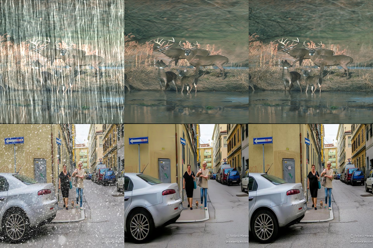
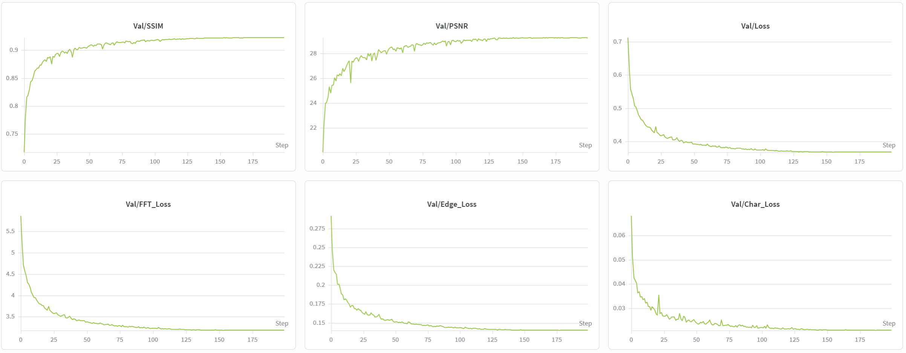

# PromptIR-Restoration: All-in-One Blind Image Restoration

**Course:** Selected Topics for Computer Vision using Deep Learning (NYCU)  
**Name:** Joaquín Rus Bono  
**Student ID:** 314553801

---

This is an image restoration framework based on PromptIR, including skip-connection prompt injection, test-time local converters, and dual-domain optimization. I implemented this model to handle multiple degradations, specifically rain and snow, in a single architecture.

## Introduction

Image restoration in "all-in-one" scenarios involves handling different degradation types while maintaining image structure. This repository contains a restoration pipeline that uses **Prompt-Learning** to change the network's behavior based on the input's degradation.

By combining the **PromptIR** baseline with the **DGPB** (CVPR 2025) and **TLC** (ECCV 2022) modules, this implementation reaches PSNR and SSIM scores on multi-degradation benchmarks.

---

## Architecture & Methodology

The implementation follows the technical details from these research papers:

### 1. Baseline Architecture: PromptIR
*   **Source:** *PromptIR: Prompting for All-in-One Blind Image Restoration (NeurIPS 2023)*.
*   **Justification:** The core framework uses a 4-level U-Net style encoder-decoder with **Multi-Dconv Head Transposed Attention (MDTA)**. I used the block distribution of **[4, 6, 6, 8]** per level. The Prompt Generation Module (PGM) uses **5 learnable prompt components**.

### 2. Skip-Connection Prompt Injection (DGPB)
*   **Source:** *Degradation-Aware Feature Perturbation for All-in-One Image Restoration (DFPIR) (CVPR 2025)*.
*   **Justification:** While standard PromptIR prompts the decoder, I used the **Degradation-Guided Perturbation Block (DGPB)** within the skip connections. This filters encoder features before they are fused with the decoder.

### 3. Test-Time Local Converter (TLC)
*   **Source:** *Improving Image Restoration by Revisiting Global Information Aggregation (ECCV 2022)*.
*   **Justification:** The **TLC module** is integrated into the Prompt Generation Module (PGM) to extract local context before prompt weight prediction. During inference, the `predict.py` script also supports **tiled inference**, which addresses the train-test distribution shift on high-resolution images by maintaining local processing consistency.

### 4. Dual-Domain Optimization (Charbonnier + FFT Loss)
*   **Source:** *Focal Frequency Loss (ICCV 2021)* & *EvenFormer (CVPR 2025)*.
*   **Justification:** I used **Charbonnier Loss** for spatial gradients and an **FFT Loss** for the frequency domain. This is intended to remove artifacts like rain streaks and snow.

### 5. Data Augmentation (CutMix and MixUp)
*   **Source:** *MixUp (ICLR 2018)* & *CutMix (ICCV 2019)*.
*   **Justification:** I used CutMix and MixUp to blend image pairs during training. This forces the network to learn transitions between different degradation types.

### 6. Inference Enhancement: 8-Fold Geometric Self-Ensemble
*   **Justification:** During inference, I generate 8 geometrically transformed versions of the input (using combinations of 90/180/270 rotations and flips). Averaging the realigned predictions acts as a powerful variance-reduction filter to maximize the objective PSNR score.

---

## Environment Setup

This project uses `uv` for dependency management. To ensure the environment matches the lockfile exactly, use `uv sync`.

1.  **Install `uv`**:
    ```bash
    pip install uv
    ```

2.  **Sync Environment**:
    ```bash
    # This creates the .venv and installs all dependencies from uv.lock
    uv sync
    ```

3.  **Activate Virtual Environment**:
    ```bash
    # On Windows:
    .venv\Scripts\activate
    # On Linux/macOS:
    source .venv/bin/activate
    ```

---

## Usage

### Training
The training script uses **Distributed Data Parallel (DDP)** via `accelerate`.

```bash
# Using accelerate
accelerate launch src/train.py --data_dir dataset/train --batch_size 8 --epochs 100

# Using torchrun directly
torchrun --nproc_per_node=2 src/train.py --data_dir dataset/train --batch_size 8
```

Hyperparameters:
- Optimizer: **AdamW** ($\beta_1=0.9, \beta_2=0.999$, weight decay $1e-3$)
- Scheduler: **Cosine Annealing** ($2 \times 10^{-4} \to 1 \times 10^{-6}$)
- Loss Weights: Charbonnier (1.0) + FFT (0.1) + Edge (0.2)

### Inference
Generate a `pred.npz` file for submission using 8-fold ensemble and optional tiling:

```bash
# Standard inference
python src/predict.py --weights checkpoints/best_model.pth --data_dir dataset/test --output pred.npz

# Tiled inference for large images (mitigates OOM and resolution shift)
python src/predict.py --weights checkpoints/best_model.pth --data_dir dataset/test --use_tiling --tile_size 256
```

---

## Performance Snapshot

### 1. Snow and rain removal


### 2. Final model metrics


### 3. Codabench competition snapshot

